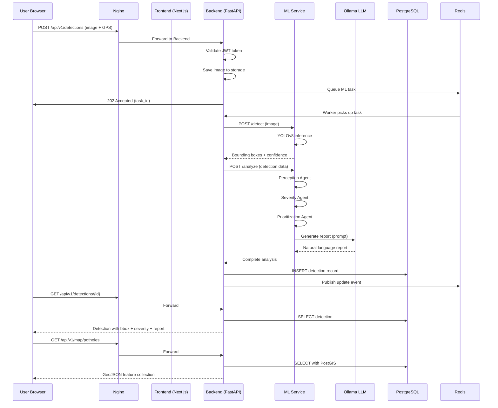

# System Architecture

## Road Pothole Detection System

---

## 1. Architecture Overview

The system follows a **microservices architecture** with 9 containerized services communicating over a Docker bridge network. Nginx serves as the single entry point, routing traffic to the appropriate service.

### High-Level Architecture Diagram

```
                            ┌─────────────────────┐
                            │     INTERNET         │
                            │   (User Browser)     │
                            └──────────┬───────────┘
                                       │
                                       │ HTTPS (443) / HTTP (80)
                                       │
                    ┌──────────────────▼──────────────────┐
                    │          NGINX REVERSE PROXY         │
                    │     (SSL Termination, Routing,       │
                    │      Static File Serving, Gzip)      │
                    │              Port: 80/443             │
                    └──┬──────────────┬──────────────┬─────┘
                       │              │              │
           /app/*      │   /api/*     │   /ml/*      │
                       │              │              │
              ┌────────▼─────┐ ┌──────▼──────┐ ┌────▼────────┐
              │   FRONTEND   │ │   BACKEND   │ │ ML SERVICE  │
              │   Next.js    │ │   FastAPI   │ │  FastAPI    │
              │              │ │             │ │             │
              │ • Dashboard  │ │ • REST API  │ │ • YOLOv8   │
              │ • Map View   │ │ • Auth/JWT  │ │ • Agents   │
              │ • Upload     │ │ • CRUD      │ │ • Ollama   │
              │ • Analytics  │ │ • GeoJSON   │ │   Client   │
              │              │ │ • Metrics   │ │ • Metrics  │
              │  Port: 3000  │ │ Port: 8000  │ │ Port: 8001 │
              └──────────────┘ └──────┬──────┘ └──┬─────┬───┘
                                      │           │     │
                           ┌──────────▼───┐  ┌────▼──┐  │
                           │  PostgreSQL  │  │ Redis │  │
                           │  + PostGIS   │  │       │  │
                           │              │  │ Cache │  │
                           │  Port: 5432  │  │ Queue │  │
                           └──────────────┘  │       │  │
                                             │ 6379  │  │
                                             └───────┘  │
                                                        │
                                              ┌─────────▼──────┐
                                              │     OLLAMA     │
                                              │  Llama 3.1 8B  │
                                              │  Mistral 7B    │
                                              │  Port: 11434   │
                                              └────────────────┘

        ┌──────────────┐    ┌──────────────┐
        │  PROMETHEUS  │───▶│   GRAFANA    │
        │  Port: 9090  │    │  Port: 3001  │
        │              │    │              │
        │ Scrapes:     │    │ Dashboards:  │
        │ • Backend    │    │ • API Perf   │
        │ • ML Service │    │ • ML Metrics │
        │ • Node Exp.  │    │ • System     │
        └──────────────┘    └──────────────┘
```

---

## 2. Service Communication

### 2.1 Request Flow: Image Upload → Detection → Map



### 2.2 Internal Network Topology

```
Docker Network: pothole-network (bridge)

┌─────────────────────────────────────────────────────────┐
│                    pothole-network                       │
│                                                         │
│  frontend:3000  ←→  nginx:80                            │
│  backend:8000   ←→  nginx:80                            │
│  ml-service:8001 ←→ backend:8000                        │
│  postgres:5432  ←→  backend:8000, ml-service:8001       │
│  redis:6379     ←→  backend:8000                        │
│  ollama:11434   ←→  ml-service:8001                     │
│  prometheus:9090 ←→ backend:8000, ml-service:8001       │
│  grafana:3001   ←→  prometheus:9090                     │
│                                                         │
│  External exposure (via Nginx):                         │
│  • Port 80/443 → Nginx                                  │
│  • Port 3001   → Grafana (optional)                     │
│                                                         │
│  All other ports internal only                          │
└─────────────────────────────────────────────────────────┘
```

---

## 3. Service Specifications

### 3.1 Frontend Service (Next.js)

| Property | Value |
|----------|-------|
| **Framework** | Next.js 14+ (App Router) |
| **Port** | 3000 |
| **Responsibilities** | UI rendering, client-side routing, API calls to backend |
| **Key Libraries** | react-leaflet, recharts, axios, tailwindcss |
| **Build** | `next build` → static + server-rendered pages |
| **Docker** | Multi-stage: Node build → Nginx serve (production) |

### 3.2 Backend Service (FastAPI)

| Property | Value |
|----------|-------|
| **Framework** | FastAPI (Python 3.11+) |
| **Port** | 8000 |
| **Responsibilities** | REST API, authentication, CRUD, geo queries, ML orchestration |
| **Key Libraries** | sqlalchemy[asyncio], asyncpg, pydantic, python-jose, bcrypt, httpx |
| **Workers** | Uvicorn with 4 workers (auto-scaled based on CPU cores) |
| **Docker** | Multi-stage: pip install → slim runtime |

### 3.3 ML Service (FastAPI)

| Property | Value |
|----------|-------|
| **Framework** | FastAPI (Python 3.11+) |
| **Port** | 8001 |
| **Responsibilities** | YOLO inference, Agentic AI pipeline, Ollama client |
| **Key Libraries** | ultralytics, torch, Pillow, httpx (for Ollama) |
| **Model Loading** | Singleton pattern — model loaded once on startup |
| **Docker** | Based on `python:3.11-slim` + PyTorch CPU |

### 3.4 PostgreSQL + PostGIS

| Property | Value |
|----------|-------|
| **Image** | `postgis/postgis:16-3.4` |
| **Port** | 5432 (internal only) |
| **Extensions** | PostGIS, uuid-ossp |
| **Volume** | `postgres_data:/var/lib/postgresql/data` |
| **Backup** | Scheduled `pg_dump` via cron container or script |

### 3.5 Redis

| Property | Value |
|----------|-------|
| **Image** | `redis:7-alpine` |
| **Port** | 6379 (internal only) |
| **Use Cases** | Response caching (TTL: 1h), ML task queue, rate limiting |
| **Persistence** | RDB snapshots (optional for dev) |

### 3.6 Ollama

| Property | Value |
|----------|-------|
| **Image** | `ollama/ollama:latest` |
| **Port** | 11434 (internal only) |
| **Models** | `llama3.1:8b` (primary), `mistral:7b` (fallback) |
| **Volume** | `ollama_data:/root/.ollama` (model cache) |
| **RAM Requirement** | Minimum 8GB for 8B parameter model |

### 3.7 Nginx

| Property | Value |
|----------|-------|
| **Image** | `nginx:alpine` |
| **Ports** | 80 (HTTP), 443 (HTTPS) |
| **Routing** | `/` → Frontend, `/api/` → Backend, `/ml/` → ML Service |
| **Features** | Gzip, static caching, rate limiting, proxy headers |

### 3.8 Prometheus

| Property | Value |
|----------|-------|
| **Image** | `prom/prometheus:latest` |
| **Port** | 9090 (internal) |
| **Scrape Targets** | Backend (:8000/metrics), ML Service (:8001/metrics) |
| **Retention** | 15 days |

### 3.9 Grafana

| Property | Value |
|----------|-------|
| **Image** | `grafana/grafana:latest` |
| **Port** | 3001 (external) |
| **Data Source** | Prometheus |
| **Dashboards** | API performance, ML inference, system resources |

---

## 4. Data Flow Architecture

### 4.1 Write Path (Detection Creation)

```
Image Upload → Backend validates → Store image on disk
                                 → Queue ML task in Redis
                                 → Worker calls ML Service
                                 → ML runs YOLOv8 → returns bbox
                                 → ML runs Agentic AI → returns analysis
                                 → Backend stores in PostgreSQL
                                 → Client polls / WebSocket update
```

### 4.2 Read Path (Map / Dashboard)

```
Client requests → Nginx routes to Backend
                → Backend queries PostgreSQL (with PostGIS for geo)
                → Redis cache check (hit → return cached)
                → Database query → format as GeoJSON
                → Cache result in Redis (TTL: 5min)
                → Return to client
```

### 4.3 Agentic AI Pipeline Flow

```
Detection Data → Orchestrator
              → Agent 1: Perception (image analysis)
              → Agent 2: Severity (multi-criteria scoring)
              → Agent 3: Prioritization (global ranking)
              → Agent 4: Reporting (Ollama LLM call)
              → Store all outputs → Return combined result
```

---

## 5. Security Architecture

```
┌─────────────────────────────────────────┐
│              SECURITY LAYERS             │
│                                          │
│  Layer 1: NGINX                          │
│  ├── SSL/TLS termination (HTTPS)         │
│  ├── Rate limiting (10 req/sec/IP)       │
│  ├── Request size limits (10MB)          │
│  └── Security headers (CSP, HSTS, etc.) │
│                                          │
│  Layer 2: BACKEND (FastAPI)              │
│  ├── JWT authentication (Bearer token)   │
│  ├── RBAC (admin/operator/viewer)        │
│  ├── CORS (allowed origins only)         │
│  ├── Input validation (Pydantic)         │
│  └── SQL injection prevention (ORM)      │
│                                          │
│  Layer 3: DATABASE                       │
│  ├── Password hashing (bcrypt, cost 12)  │
│  ├── Internal network only (no external) │
│  └── Parameterized queries (SQLAlchemy)  │
│                                          │
│  Layer 4: DOCKER NETWORK                 │
│  ├── Internal bridge network             │
│  ├── Only Nginx exposed to host          │
│  └── Service-to-service via DNS names    │
└─────────────────────────────────────────┘
```

---

## 6. Deployment Architecture

### 6.1 Development

```bash
# Single command starts everything
docker compose -f docker-compose.yml -f docker-compose.dev.yml up

# Features:
# - Hot reload for frontend (Next.js dev server)
# - Hot reload for backend (Uvicorn --reload)
# - Debug ports exposed
# - Volume mounts for live code changes
```

### 6.2 Production

```bash
# Production build and deploy
docker compose up -d --build

# Features:
# - Optimized builds (multi-stage)
# - No debug ports
# - Resource limits enforced
# - Restart policies enabled
# - Health checks active
```

---

## 7. Scalability Strategy (Future)

| Current (v1.0) | Future (v2.0) |
|----------------|---------------|
| Docker Compose (single server) | Kubernetes / Docker Swarm |
| Single ML Service instance | Multiple ML replicas behind load balancer |
| PostgreSQL single instance | Read replicas for queries |
| Redis single instance | Redis Cluster |
| Local file storage | Object storage (S3/MinIO) |
| Ollama single instance | Ollama with GPU node pool |
