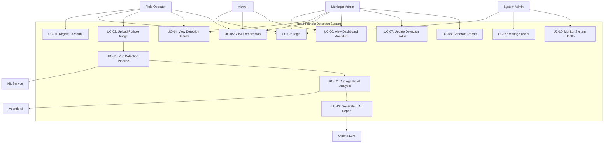

# Use Case Specification

## Road Pothole Detection System

---

## 1. Actor Definitions

| Actor | Type | Description |
|-------|------|-------------|
| **Field Operator** | Primary (Human) | On-ground staff who captures and uploads pothole images |
| **Municipal Admin** | Primary (Human) | Decision-maker who reviews detections, prioritizes repairs, generates reports |
| **System Admin** | Secondary (Human) | Manages users, monitors system health, configures settings |
| **Viewer** | Secondary (Human) | Read-only access to dashboard and map (e.g., public officials, researchers) |
| **Agentic AI System** | System (Autonomous) | Multi-agent pipeline that autonomously processes detections |
| **ML Service** | System (Internal) | YOLOv8 inference engine that processes images |
| **Ollama LLM** | System (Internal) | Local language model that generates natural language reports |

---

## 2. Use Case Diagram

---

## 3. Detailed Use Cases

### UC-01: Register Account

| Field | Description |
|-------|-------------|
| **ID** | UC-01 |
| **Name** | Register Account |
| **Actor** | Field Operator, Municipal Admin |
| **Precondition** | User does not have an existing account |
| **Trigger** | User navigates to registration page |
| **Main Flow** | 1. User enters email, password, and name 2. System validates email format and password strength 3. System checks email is not already registered 4. System hashes password with bcrypt 5. System creates user record with default role "operator" 6. System returns JWT access token + refresh token 7. User is redirected to dashboard |
| **Alternative Flow** | 3a. Email already exists → Return error "Email already registered" |
| **Postcondition** | New user record exists in database; user is authenticated |

### UC-02: Login

| Field | Description |
|-------|-------------|
| **ID** | UC-02 |
| **Name** | Login |
| **Actor** | All human actors |
| **Precondition** | User has a registered account |
| **Trigger** | User navigates to login page |
| **Main Flow** | 1. User enters email and password 2. System retrieves user by email 3. System verifies password against stored hash 4. System generates JWT access token (30min) + refresh token (7 days) 5. User is redirected to dashboard |
| **Alternative Flow** | 2a. User not found → Return "Invalid credentials" 3a. Password mismatch → Return "Invalid credentials" |
| **Postcondition** | User has valid JWT token for subsequent requests |

### UC-03: Upload Pothole Image

| Field | Description |
|-------|-------------|
| **ID** | UC-03 |
| **Name** | Upload Pothole Image for Detection |
| **Actor** | Field Operator |
| **Precondition** | User is authenticated with role "operator" or "admin" |
| **Trigger** | User clicks "Upload" and selects image file |
| **Main Flow** | 1. User selects image file (JPEG/PNG, max 10MB) 2. User optionally provides GPS coordinates (or browser geolocation) 3. System validates file type and size 4. System saves image to storage 5. System sends image to ML Service for detection (UC-11) 6. ML Service returns bounding boxes + confidence scores 7. System triggers Agentic AI analysis (UC-12) 8. System stores detection record in database 9. User sees annotated image with detection results |
| **Alternative Flow** | 3a. Invalid file type → Return "Unsupported format" 5a. ML Service unavailable → Queue for retry, show "Processing..." |
| **Postcondition** | Detection record with bbox, severity, GPS, and AI analysis stored in DB |

### UC-04: View Detection Results

| Field | Description |
|-------|-------------|
| **ID** | UC-04 |
| **Name** | View Detection Results |
| **Actor** | Field Operator, Municipal Admin |
| **Precondition** | User is authenticated; detections exist in database |
| **Trigger** | User navigates to detection list or clicks a specific detection |
| **Main Flow** | 1. System retrieves detections with pagination (default: 20 per page) 2. User can filter by: severity, status, date range, source type 3. User can sort by: date, severity, confidence 4. User clicks a detection to view details 5. System shows: annotated image, bounding boxes, severity, confidence, GPS location, AI analysis report, status history |
| **Postcondition** | User has reviewed detection details |

### UC-05: View Pothole Map

| Field | Description |
|-------|-------------|
| **ID** | UC-05 |
| **Name** | View Interactive Pothole Map |
| **Actor** | All human actors |
| **Precondition** | User is authenticated; detections with GPS data exist |
| **Trigger** | User navigates to Map page |
| **Main Flow** | 1. System fetches all detection locations as GeoJSON 2. Map renders with OpenStreetMap tiles 3. Markers are color-coded: Low, Medium, High, Critical 4. Nearby markers are clustered at lower zoom levels 5. User can toggle heatmap layer 6. User clicks marker → popup shows detection summary 7. User can filter markers by severity/status |
| **Postcondition** | User has visual understanding of pothole distribution |

### UC-06: View Dashboard Analytics

| Field | Description |
|-------|-------------|
| **ID** | UC-06 |
| **Name** | View Analytics Dashboard |
| **Actor** | Municipal Admin, Viewer |
| **Precondition** | User is authenticated; detection data exists |
| **Trigger** | User navigates to dashboard/analytics page |
| **Main Flow** | 1. System computes summary statistics (total, by severity, by status) 2. System generates time-series trend data 3. Dashboard displays: stat cards, severity pie chart, trend line chart, recent detections list, top affected areas 4. User can filter by date range |
| **Postcondition** | User has data-driven overview of pothole situation |

### UC-07: Update Detection Status

| Field | Description |
|-------|-------------|
| **ID** | UC-07 |
| **Name** | Update Detection Status |
| **Actor** | Municipal Admin |
| **Precondition** | User is authenticated with role "admin"; detection exists |
| **Trigger** | Admin clicks status update button on detection detail |
| **Main Flow** | 1. Admin selects new status: detected → verified → repair_scheduled → resolved 2. System validates state transition (must follow sequence) 3. System updates detection record 4. System logs status change in audit trail |
| **Alternative Flow** | 2a. Invalid transition (e.g., detected → resolved) → Return error |
| **Postcondition** | Detection status updated; audit log created |

### UC-08: Generate Report

| Field | Description |
|-------|-------------|
| **ID** | UC-08 |
| **Name** | Generate Area/Time Report |
| **Actor** | Municipal Admin |
| **Precondition** | User is authenticated with role "admin" |
| **Trigger** | Admin clicks "Generate Report" with filters |
| **Main Flow** | 1. Admin selects date range and/or geographic area 2. System aggregates detection data for the selection 3. System generates PDF report with: summary stats, severity breakdown, map snapshot, top priority repairs, AI recommendations 4. Report is available for download |
| **Postcondition** | PDF report generated and downloadable |

### UC-09: Manage Users

| Field | Description |
|-------|-------------|
| **ID** | UC-09 |
| **Name** | Manage Users and Roles |
| **Actor** | System Admin |
| **Precondition** | User is authenticated with role "admin" |
| **Main Flow** | 1. Admin views list of all users 2. Admin can change user roles (admin/operator/viewer) 3. Admin can deactivate/reactivate user accounts |
| **Postcondition** | User roles and statuses updated |

### UC-10: Monitor System Health

| Field | Description |
|-------|-------------|
| **ID** | UC-10 |
| **Name** | Monitor System Health |
| **Actor** | System Admin |
| **Precondition** | Prometheus and Grafana are running |
| **Main Flow** | 1. Admin accesses Grafana dashboard 2. Dashboard shows: API request rates, error rates, response latencies, ML inference times, database connection pool, container resource usage 3. Alerting rules notify on anomalies |
| **Postcondition** | Admin has visibility into system health |

### UC-11: Run Detection Pipeline (System)

| Field | Description |
|-------|-------------|
| **ID** | UC-11 |
| **Name** | Run YOLOv8 Detection Pipeline |
| **Actor** | ML Service (triggered by backend) |
| **Trigger** | Backend sends image to ML service via HTTP |
| **Main Flow** | 1. ML Service receives image 2. Preprocessor: resize, normalize image 3. YOLOv8 model runs inference 4. Postprocessor: NMS, format bounding boxes 5. Return: list of detections with bbox coordinates, confidence scores, class labels |
| **Postcondition** | Detection results returned to backend |

### UC-12: Run Agentic AI Analysis (System)

| Field | Description |
|-------|-------------|
| **ID** | UC-12 |
| **Name** | Execute Agentic AI Multi-Agent Pipeline |
| **Actor** | Agentic AI System (autonomous) |
| **Trigger** | New detection record created in database |
| **Main Flow** | 1. **Orchestrator** receives new detection event 2. **Perception Agent**: Analyzes pothole size, depth estimate, road type → outputs perception report 3. **Severity Agent**: Scores severity using weighted criteria (size 30%, road type 20%, traffic density 25%, historical recurrence 25%) → outputs severity score (0-100) + classification 4. **Prioritization Agent**: Ranks this detection against all active potholes → updates priority queue 5. **Reporting Agent**: Sends all data to Ollama LLM → generates human-readable report (UC-13) 6. Orchestrator saves all agent outputs to database |
| **Error Handling** | If any agent fails: log error, retry once, if still fails mark as "analysis_failed" and continue |
| **Postcondition** | Detection enriched with severity, priority, and AI report |

### UC-13: Generate LLM Report (System)

| Field | Description |
|-------|-------------|
| **ID** | UC-13 |
| **Name** | Generate Natural Language Report via Ollama |
| **Actor** | Ollama LLM (called by Reporting Agent) |
| **Trigger** | Reporting Agent sends structured data to Ollama |
| **Main Flow** | 1. Reporting Agent constructs prompt with detection data, perception report, severity score, and priority context 2. Ollama processes prompt with Llama 3.1 8B model 3. LLM generates: summary of findings, repair recommendation, cost estimate, urgency level 4. Reporting Agent parses and stores the report |
| **Postcondition** | Natural language report stored in detection's `ai_analysis` JSONB field |

---

## 4. Use Case Priority Matrix

| Priority | Use Cases | Justification |
|----------|-----------|---------------|
| **P0 — Must Ship** | UC-01, UC-02, UC-03, UC-04, UC-05, UC-06, UC-11, UC-12 | Core functionality: auth, detection, map, analytics |
| **P1 — Should Ship** | UC-07, UC-10, UC-13 | Important for production: status management, monitoring, LLM reports |
| **P2 — Nice to Have** | UC-08, UC-09 | Enhancement: PDF reports, user management |
